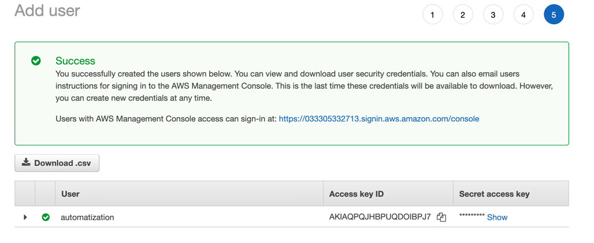
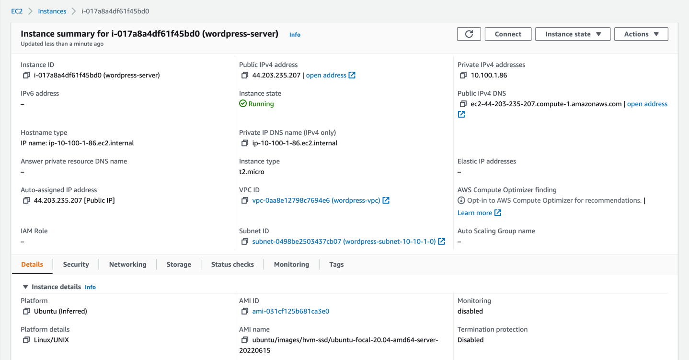

# AWS

Створила користувача на AWS для terraform

Створено файл конфігурації для terraform.

Щоб використати ключі треба використати змінні оточення. Їх задати можна командами
~~~
export AWS_ACCESS_KEY_ID=key
export AWS_SECRET_ACCESS_KEY=secret
~~~

Командами `terraform init`, `terraform plan` перевірено чи працює авторизація,
`terraform apply` розгорнуто інфраструктуру дла wordpress

